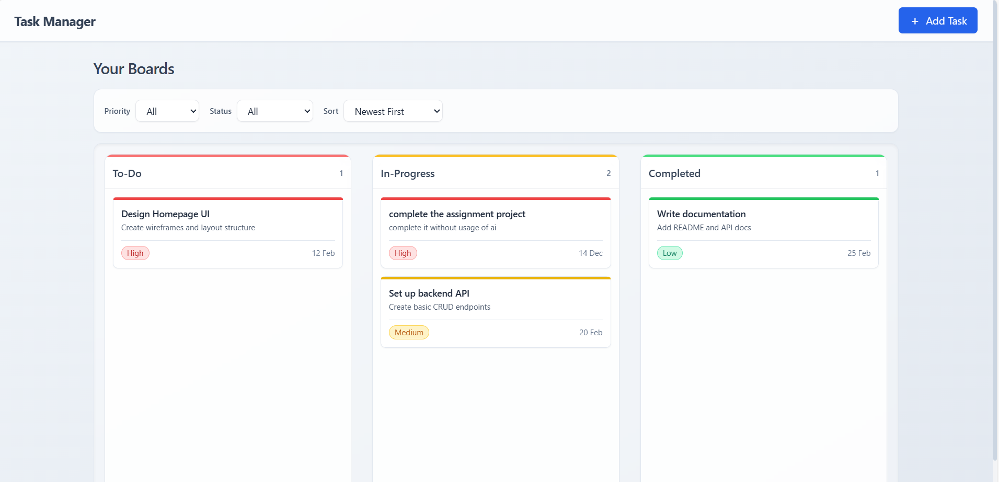
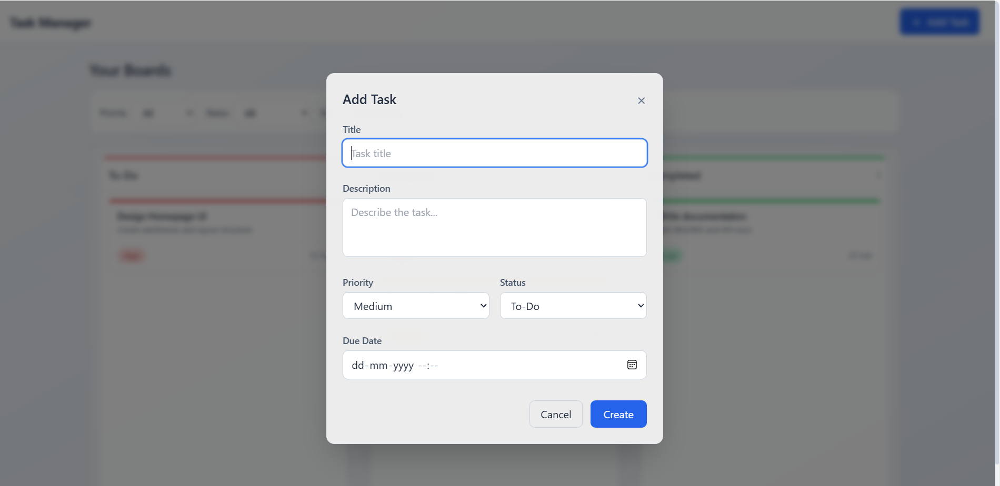

# Task Manager

A clean and minimal task-management application built with React and Tailwind CSS.  
It provides an easy way to organize work using boards, drag-and-drop interaction, filters, and a simple task editor.

---

## 🚀 Features

- Create, edit, and delete tasks  
- Drag and drop tasks between **To-Do**, **In-Progress**, and **Completed**  
- Priority labels (Low, Medium, High)  
- Due-date display and sorting  
- LocalStorage persistence (tasks remain saved)  
- Duplicate-task detection  
- Smooth UI animations and polished layout  
- Fully responsive design

---

## 📸 Screenshots

### Dashboard View  


### Task Modal  


---

## 🛠️ Tech Stack

- **React (Vite)**
- **Tailwind CSS**
- **@hello-pangea/dnd** (Drag & Drop)
- **Day.js** (Date handling)
- **LocalStorage** for data persistence

---

## 📂 Folder Structure

task-manager/
│── public/
│── src/
│ ├── assets/
│ ├── components/
│ │ ├── BoardColumn.jsx
│ │ ├── FilterBar.jsx
│ │ ├── Navbar.jsx
│ │ ├── TaskCard.jsx
│ │ └── TaskModal.jsx
│ ├── data/
│ │ └── tasks.json
│ ├── hooks/
│ │ └── useLocalStorage.js
│ ├── App.jsx
│ ├── index.css
│ └── main.jsx
│
├── README.md
├── package.json
├── tailwind.config.cjs
└── vite.config.js

---

## 🔧 Installation & Setup

### 1. Clone the repo

```sh
git clone https://github.com/saniya-fathima001/task-manager.git
cd task-manager
2. Install dependencies
npm install

3. Start the development server
npm run dev

Build for production
npm run build

 Author
Saniya Fathima
GitHub: https://github.com/saniya-fathima001

📄 License
This project is open source and available under the MIT License.

✔️ Notes
All tasks are stored locally in your browser using LocalStorage.

The app does not require any backend or database to run.

It is designed to be simple, easy to follow, and beginner-friendly.

Feel free to contribute or open issues if you'd like to improve the project!
